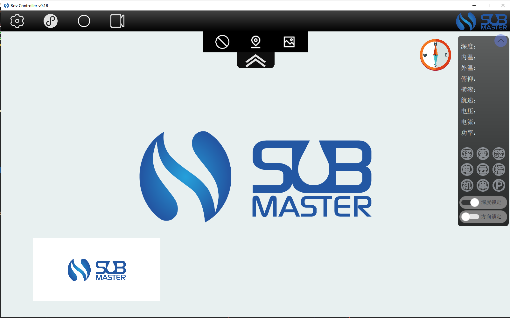
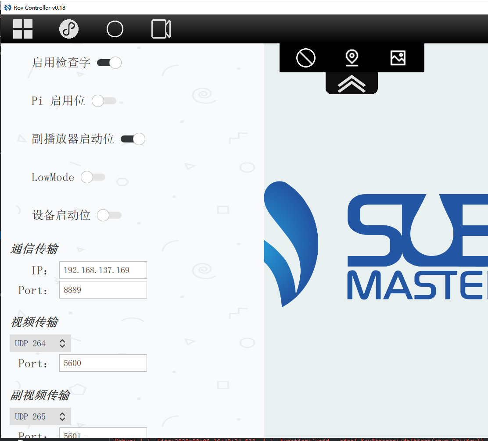
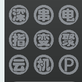
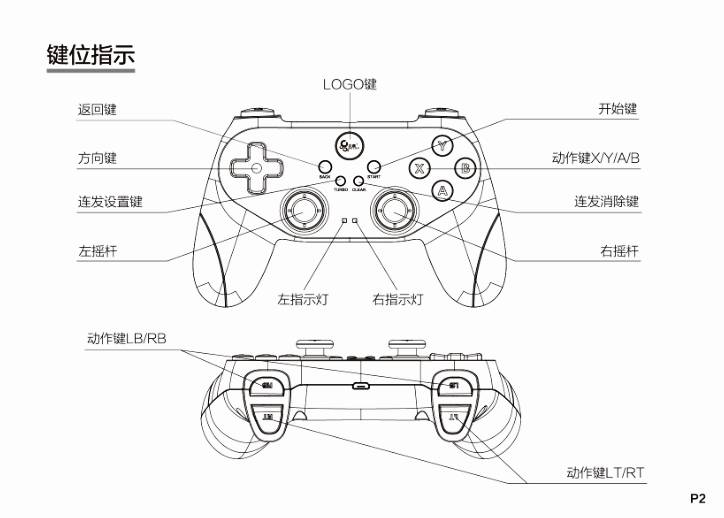

# ROV使用帮助文档

## 程序启动：

通过启动根目录下 ==SUB_Rov.exe== 启动程序

## 一、界面介绍

界面中心是项目LOGO，有上角有一个可点击的同样的logo，点击后打开about页面

工具栏从左至右四个按钮分别为：设置页、数据连接、视频流重置、录像开启/关闭。

中间的延申按钮点击后呈现：

分别为深度锁定按钮、方向锁定按钮、截图按钮。

窗体右边的是下位机信息展示，鼠标可拖拽。该组件右上角的按钮可以收起/展开信息展示。与组件相邻的是罗盘展示。

左下角是副播放器的区域。

 

 

设置界面窗口：

 

 

### 对于图标指示的功能为：

1. 深：深度传感器（高亮为正常，熄灭为故障）
2. 串：串口（高亮为正常，熄灭为故障）
3. 电：电源监测设备（高亮为正常，熄灭为故障）
4. 指：指南针（高亮为正常，熄灭为故障）
5. 变：变焦（高亮为未开到尽头，熄灭为开到尽头）
6. 聚：聚焦，（同变焦）
7. 云：云台角度（同变焦）
8. 机：机器手（同变焦）
9. P：设备停止状态：（高亮为停止，熄灭则非停止）

 

 

## 二、操作介绍

### 键盘按键映射：

| 键盘按键   | 对应功能                               |
| ---------- | -------------------------------------- |
| W、A、S、D | 前进、左移、后退、右移                 |
| Q、E       | 左旋、右旋                             |
| R、F       | 灯亮、灯灭                             |
| Y、H       | 加油、减油                             |
| U、J       | 开机器手、关闭机器手                   |
| I、K       | 云台向上、云台向下                     |
| P          | 截图（保存于./resource/images）        |
| ↑、↓、←、→ | 变焦放大、变焦缩小、聚焦缩小、聚焦放大 |
| F1         | 深度锁定                               |
| F2         | 方向锁定                               |

### 手柄按键映射：

如果您使用的不是xbox（PC）手柄，请根据手柄操作指南更改手柄的模式。

北通手柄请参见官网说明书：[北通手柄指南](http://www.betop-cn.com/guide)

| 按键          | 映射                                                         |
| ------------- | ------------------------------------------------------------ |
| 左摇杆        | 前后左右移动控制                                             |
| 右摇杆        | （x轴）聚焦放大（向右）、缩小（向左）。（y轴）变焦放大（向前）、缩小（向后） |
| 左-上下左右键 | 上：加油，下：减油，左：云台向下，右：云台向上               |
| A             | 灯灭                                                         |
| Y             | 灯亮                                                         |
| X             | 机器手收紧                                                   |
| B             | 机器手打开                                                   |
| LB、RB        | 左旋、右旋                                                   |
| LT、RT        | 下降、上升                                                   |
| Start         | 深度锁定                                                     |
| Back/Select   | 方向锁定                                                     |
| 左摇杆中心键  | 重置视频流                                                   |
| 右摇杆中心键  | 拍照/截图                                                    |

## 三、使用组件、库介绍

在键盘、手柄的监听、响应上，使用的是qt自带的事件库和QGamepad库

在视频、图像传输，使用的是gstreamer-1.0

通过qt中QSettings建立的程序的配置文件，程序会保存对端口、url修改后的数值并在下一次启动时加载。

## 四、常见问题

