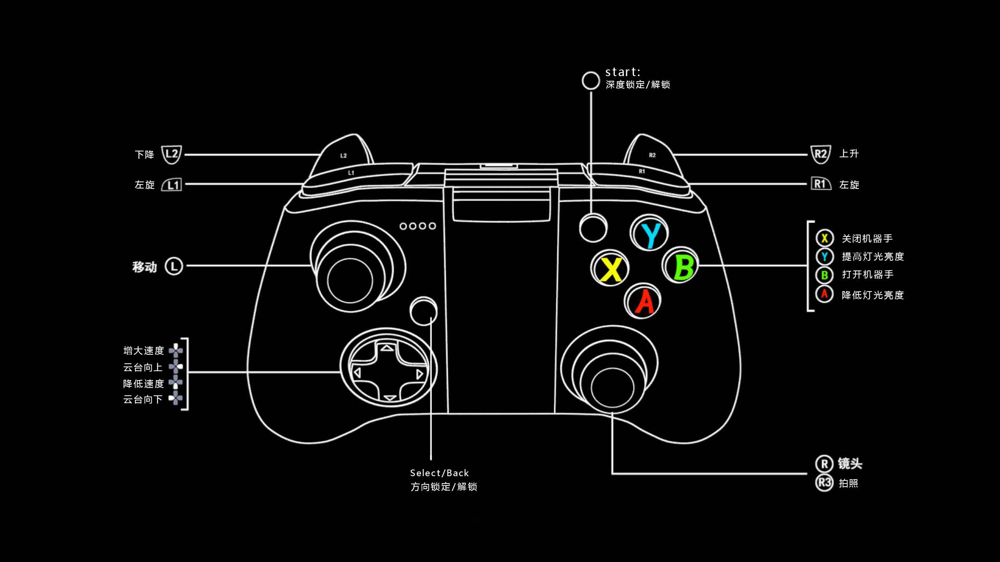

# ROV按键映射

## 键盘

| 键盘按键   | 对应功能                               |
| ---------- | -------------------------------------- |
| W、A、S、D | 前进、左移、后退、右移                 |
| Q、E       | 左旋、右旋                             |
| R、F       | 灯亮、灯灭                             |
| Y、H       | 加油、减油                             |
| U、J       | 开机器手、关闭机器手                   |
| I、K       | 云台向上、云台向下                     |
| P          | 截图（保存于./resource/images）        |
| ↑、↓、←、→ | 变焦放大、变焦缩小、聚焦缩小、聚焦放大 |
| F1         | 深度锁定                               |
| F2         | 方向锁定                               |

## 手柄

| 按键          | 映射                                                         |
| ------------- | ------------------------------------------------------------ |
| 左摇杆        | 前后左右移动控制                                             |
| 右摇杆        | （x轴）聚焦放大（向右）、缩小（向左）。（y轴）变焦放大（向前）、缩小（向后） |
| 左-上下左右键 | 上：加油，下：减油，左：云台向下，右：云台向上               |
| A             | 灯灭    |
| Y             | 灯亮      |
| X             | 机器手收紧   |
| B             | 机器手打开   |
| LB、RB        | 左旋、右旋     |
| LT、RT        | 下降、上升      |
| Start | 深度锁定 |
| Back/Select | 方向锁定|
| 左摇杆中心键 | 重置视频流 |
| 右摇杆中心键 | 拍照/截图 |

